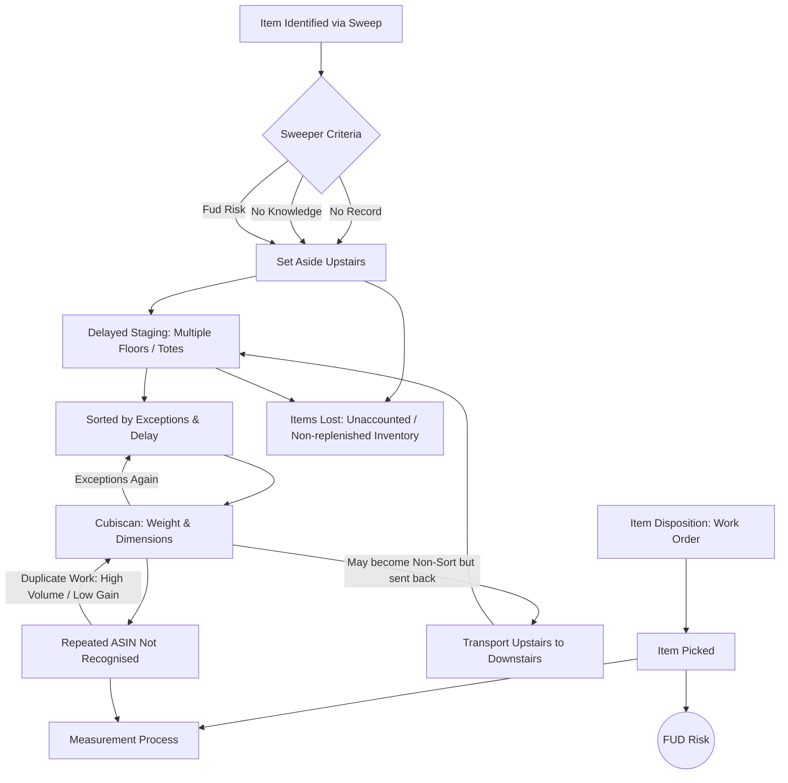

```mermaid

graph TD
    %% 1. Standard Flow
    A[Item Disposition: Work Order] --> B[Item Picked]
    B --> C[Measurement Process]
    B --> FUD((FUD Risk))
    
    %% 2. Exception Identification & Staging
    D[Item Identified via Sweep] --> E{Sweeper Criteria}
    E -->|No Record| F[Set Aside Upstairs]
    E -->|No Knowledge| F
    E -->|Fud Risk| F
    
    F --> G[Delayed Staging: Multiple Floors / Totes]
    G --> H[Sorted by Exceptions & Delay]

    %% 3. Cubiscan Processing & Loops
    H --> I[Cubiscan: Weight & Dimensions]
    
    %% Loop A
    I -->|Exceptions Again| H
    
    %% Loop B
    I -->|May become Non-Sort but sent back| J[Transport Upstairs to Downstairs]
    J --> G
    
    %% Duplicate Work Loop
    I --> K[Repeated ASIN Not Recognised]
    K -->|Duplicate Work: High Volume / Low Gain| I
    K --> C

    %% Operational Risk Area
    F --> L[Items Lost: Unaccounted / Non-replenished Inventory]
    G --> L

```
